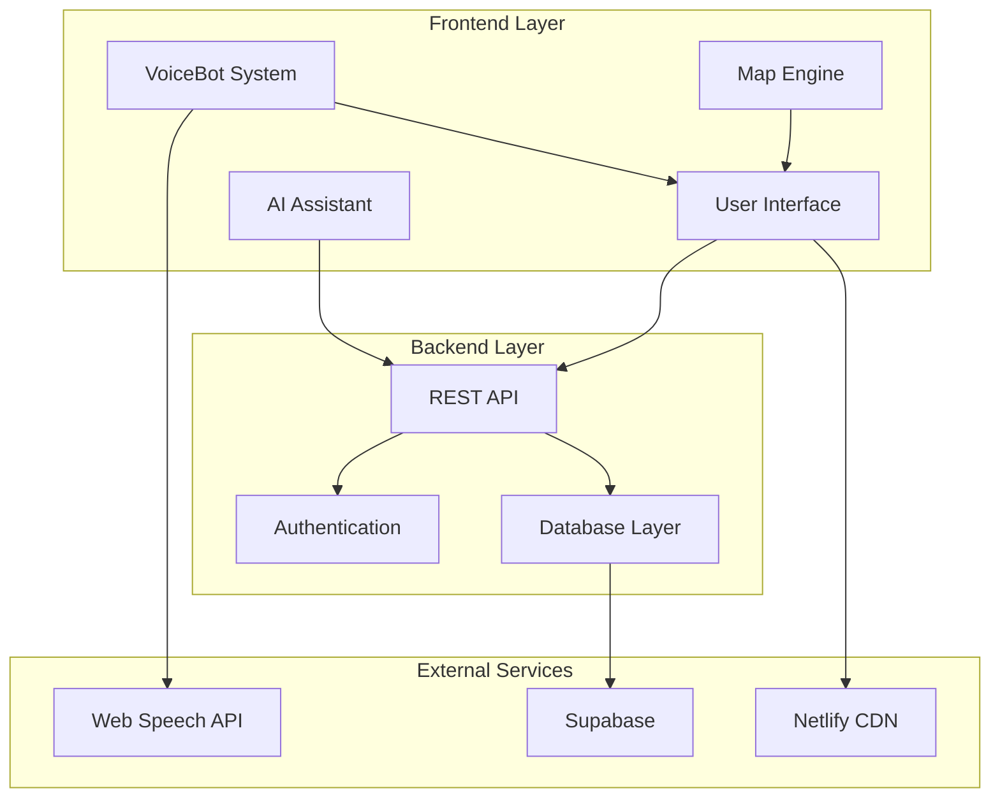
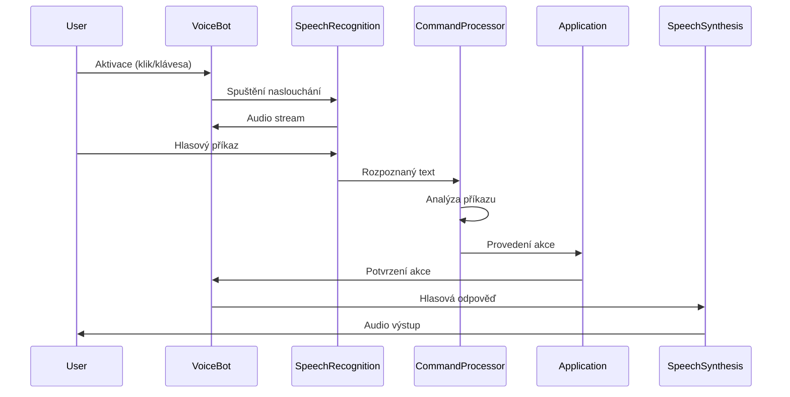
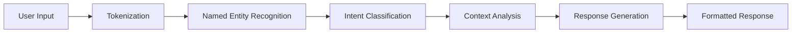
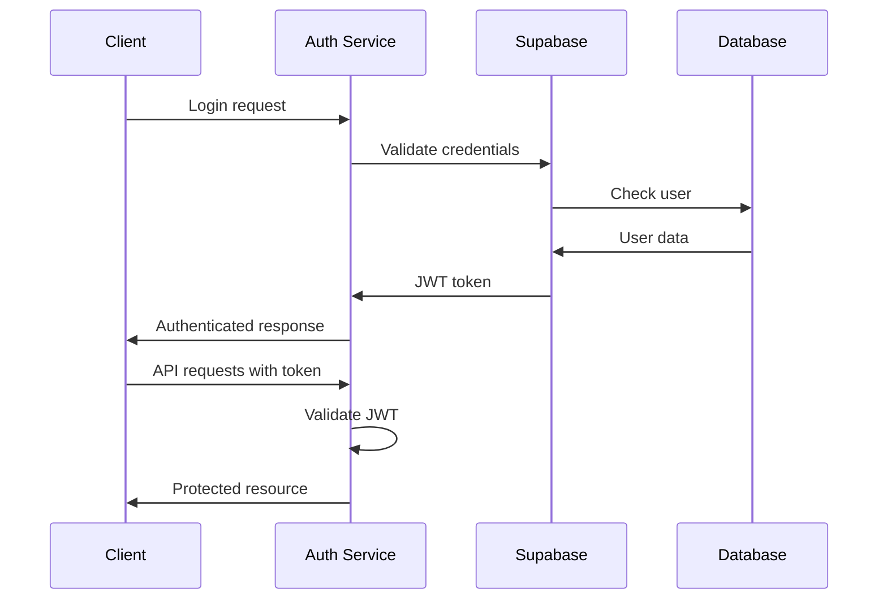

# 🏗️ AIMapa - Architektura systému

> **Technický přehled architektury AIMapa aplikace s důrazem na VoiceBot systém**

## 🎯 Celkový přehled

AIMapa je moderní webová aplikace postavená na mikroservisní architektuře s modulárním frontend designem a pokročilým VoiceBot systémem.

### 🏛️ Architektonické principy
- **Modularity** - Nezávislé komponenty s jasným rozhraním
- **Scalability** - Horizontální škálování komponent
- **Maintainability** - Čistý kód s jasnou strukturou
- **Accessibility** - Podpora pro handicapované uživatele
- **Performance** - Optimalizace pro rychlé načítání

## 📊 Systémová architektura



## 🎤 VoiceBot Architektura

### Komponenty VoiceBot systému

```
VoiceBot System
├── Core Engine
│   ├── SpeechRecognition    # Rozpoznávání řeči
│   ├── SpeechSynthesis      # Syntéza řeči
│   └── CommandProcessor    # Zpracování příkazů
├── UI Components
│   ├── ToggleButton        # Aktivační tlačítko
│   ├── StatusIndicator     # Indikátor stavu
│   └── HelpPanel          # Nápověda
├── Integration Layer
│   ├── MapController       # Ovládání mapy
│   ├── AIConnector        # Propojení s AI
│   └── ServiceBridge      # Propojení se službami
└── Configuration
    ├── CommandRegistry     # Registr příkazů
    ├── LanguageSettings   # Jazykové nastavení
    └── UserPreferences    # Uživatelské preference
```

### 🔄 VoiceBot Flow



## 🗺️ Map Engine Architektura

### Mapové komponenty

```javascript
// Hlavní mapová instance
window.map = L.map('map', {
    center: [48.8553, 17.1225], // Hodonín
    zoom: 13,
    zoomControl: true,
    attributionControl: true
})

// Vrstvy mapy
const layers = {
    base: L.tileLayer('https://{s}.tile.openstreetmap.org/{z}/{x}/{y}.png'),
    satellite: L.tileLayer('https://server.arcgisonline.com/...'),
    terrain: L.tileLayer('https://{s}.tile.opentopomap.org/...')
}

// Ovládací prvky
const controls = {
    zoom: L.control.zoom(),
    scale: L.control.scale(),
    fullscreen: L.control.fullscreen(),
    globe: new GlobeControl()
}
```

### 🌍 3D Globe Integration

```javascript
// Cesium.js integrace pro 3D režim
const globe = new Cesium.Viewer('cesiumContainer', {
    terrainProvider: Cesium.createWorldTerrain(),
    imageryProvider: new Cesium.OpenStreetMapImageryProvider(),
    baseLayerPicker: false,
    geocoder: false,
    homeButton: false,
    sceneModePicker: false,
    navigationHelpButton: false,
    animation: false,
    timeline: false
})
```

## 🤖 AI Assistant Architektura

### AI Komponenty

```javascript
// AI Assistant Core
class AIAssistant {
    constructor() {
        this.context = new ConversationContext()
        this.nlp = new NLPProcessor()
        this.knowledge = new KnowledgeBase()
    }
    
    async processMessage(message) {
        const intent = await this.nlp.analyze(message)
        const response = await this.generateResponse(intent)
        return this.formatResponse(response)
    }
}

// Kontextové zpracování
class ConversationContext {
    constructor() {
        this.history = []
        this.currentTopic = null
        this.userPreferences = {}
    }
}
```

### 🧠 NLP Pipeline



## 💾 Data Layer

### 🗄️ Database Schema

```sql
-- Uživatelé
CREATE TABLE users (
    id UUID PRIMARY KEY,
    email VARCHAR(255) UNIQUE,
    username VARCHAR(100),
    preferences JSONB,
    created_at TIMESTAMP DEFAULT NOW()
);

-- Mapové body
CREATE TABLE map_points (
    id UUID PRIMARY KEY,
    user_id UUID REFERENCES users(id),
    latitude DECIMAL(10, 8),
    longitude DECIMAL(11, 8),
    title VARCHAR(255),
    description TEXT,
    created_at TIMESTAMP DEFAULT NOW()
);

-- Virtuální práce
CREATE TABLE virtual_work (
    id UUID PRIMARY KEY,
    user_id UUID REFERENCES users(id),
    work_type VARCHAR(100),
    earnings DECIMAL(10, 2),
    duration INTEGER, -- v minutách
    completed_at TIMESTAMP
);

-- VoiceBot usage
CREATE TABLE voicebot_usage (
    id UUID PRIMARY KEY,
    user_id UUID REFERENCES users(id),
    command VARCHAR(255),
    success BOOLEAN,
    timestamp TIMESTAMP DEFAULT NOW()
);
```

### 🔄 Real-time Synchronization

```javascript
// Supabase real-time subscription
const subscription = supabase
    .channel('map_changes')
    .on('postgres_changes', 
        { event: '*', schema: 'public', table: 'map_points' },
        (payload) => {
            updateMapInRealTime(payload)
        }
    )
    .subscribe()
```

## 🔧 Backend API

### 🛣️ API Routes Structure

```javascript
// Express.js routes
app.use('/api/auth', authRoutes)        // Autentizace
app.use('/api/map', mapRoutes)          // Mapové operace
app.use('/api/ai', aiRoutes)            // AI asistent
app.use('/api/work', virtualWorkRoutes) // Virtuální práce
app.use('/api/voice', voiceBotRoutes)   // VoiceBot analytics
app.use('/api/services', servicesRoutes) // Externí služby
```

### 🔐 Authentication Flow



## 🚀 Performance Optimizations

### 📦 Code Splitting

```javascript
// Lazy loading modulů
const VoiceBot = lazy(() => import('./components/VoiceBot'))
const MapEngine = lazy(() => import('./components/MapEngine'))
const AIAssistant = lazy(() => import('./components/AIAssistant'))

// Dynamic imports pro pokročilé funkce
const loadAdvancedFeatures = async () => {
    const { AdvancedMap } = await import('./advanced/AdvancedMap')
    const { VoiceAnalytics } = await import('./advanced/VoiceAnalytics')
    return { AdvancedMap, VoiceAnalytics }
}
```

### 🗜️ Asset Optimization

```javascript
// Service Worker pro caching
self.addEventListener('fetch', event => {
    if (event.request.destination === 'script') {
        event.respondWith(
            caches.match(event.request)
                .then(response => response || fetch(event.request))
        )
    }
})

// Image optimization
const optimizeImages = {
    webp: true,
    quality: 80,
    progressive: true,
    mozjpeg: true
}
```

### ⚡ Memory Management

```javascript
// VoiceBot memory cleanup
class VoiceBotMemoryManager {
    constructor() {
        this.recognitionInstances = new WeakMap()
        this.synthesisQueue = []
        this.maxQueueSize = 10
    }
    
    cleanup() {
        // Cleanup old recognition instances
        this.recognitionInstances.clear()
        
        // Clear synthesis queue
        this.synthesisQueue.splice(0, this.synthesisQueue.length)
        
        // Force garbage collection (if available)
        if (window.gc) window.gc()
    }
}
```

## 🔍 Monitoring & Analytics

### 📊 Performance Metrics

```javascript
// Performance monitoring
const performanceObserver = new PerformanceObserver((list) => {
    list.getEntries().forEach((entry) => {
        if (entry.entryType === 'navigation') {
            analytics.track('page_load_time', {
                duration: entry.loadEventEnd - entry.loadEventStart,
                page: window.location.pathname
            })
        }
    })
})

performanceObserver.observe({ entryTypes: ['navigation', 'paint'] })
```

### 🎤 VoiceBot Analytics

```javascript
// VoiceBot usage tracking
class VoiceBotAnalytics {
    trackCommand(command, success, duration) {
        analytics.track('voicebot_command', {
            command,
            success,
            duration,
            timestamp: Date.now(),
            user_agent: navigator.userAgent
        })
    }
    
    trackRecognitionAccuracy(expected, actual) {
        const accuracy = this.calculateSimilarity(expected, actual)
        analytics.track('speech_recognition_accuracy', {
            accuracy,
            expected,
            actual
        })
    }
}
```

## 🔒 Security Architecture

### 🛡️ Security Layers

```javascript
// Content Security Policy
const csp = {
    'default-src': ["'self'"],
    'script-src': ["'self'", "'unsafe-inline'", "https://cdn.jsdelivr.net"],
    'style-src': ["'self'", "'unsafe-inline'"],
    'img-src': ["'self'", "data:", "https:"],
    'connect-src': ["'self'", "https://api.supabase.co"],
    'media-src': ["'self'"]
}

// Input sanitization
const sanitizeInput = (input) => {
    return DOMPurify.sanitize(input, {
        ALLOWED_TAGS: [],
        ALLOWED_ATTR: []
    })
}
```

### 🔐 API Security

```javascript
// Rate limiting
const rateLimit = require('express-rate-limit')

const apiLimiter = rateLimit({
    windowMs: 15 * 60 * 1000, // 15 minut
    max: 100, // max 100 requestů per window
    message: 'Too many requests from this IP'
})

app.use('/api/', apiLimiter)
```

## 🧪 Testing Architecture

### 🔬 Testing Strategy

```javascript
// Unit testy pro VoiceBot
describe('VoiceBot', () => {
    test('should recognize basic commands', async () => {
        const voiceBot = new VoiceBot()
        const result = await voiceBot.processCommand('přidat bod')
        expect(result.action).toBe('addActivity')
    })
    
    test('should handle speech synthesis', () => {
        const voiceBot = new VoiceBot()
        const spy = jest.spyOn(speechSynthesis, 'speak')
        voiceBot.speak('test message')
        expect(spy).toHaveBeenCalled()
    })
})

// E2E testy
describe('VoiceBot Integration', () => {
    test('complete voice workflow', async () => {
        await page.goto('http://localhost:3000')
        await page.click('#voiceBotToggle')
        await page.evaluate(() => {
            window.VoiceBot.processCommand('přidat bod')
        })
        const isActive = await page.$eval('#addActivity', el => el.classList.contains('active'))
        expect(isActive).toBe(true)
    })
})
```

---

**🎯 Závěr**: Tato architektura poskytuje škálovatelný, maintainable a výkonný systém s pokročilými funkcemi jako je VoiceBot, real-time synchronizace a AI asistent. Modulární design umožňuje snadné rozšiřování a údržbu.
